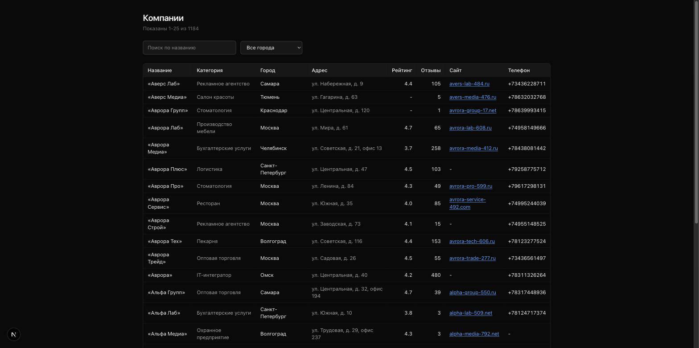
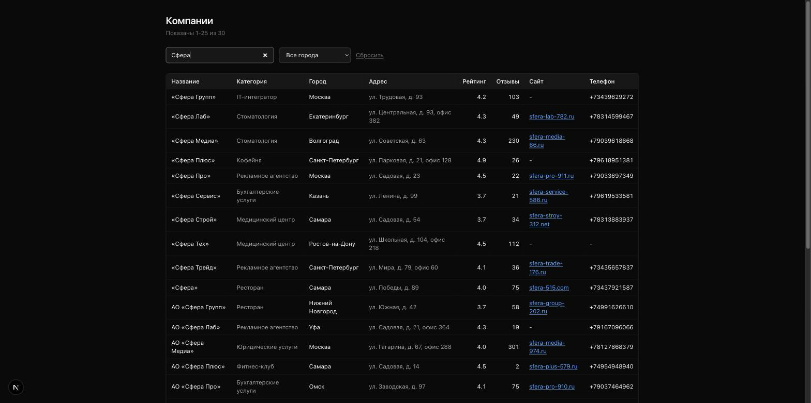
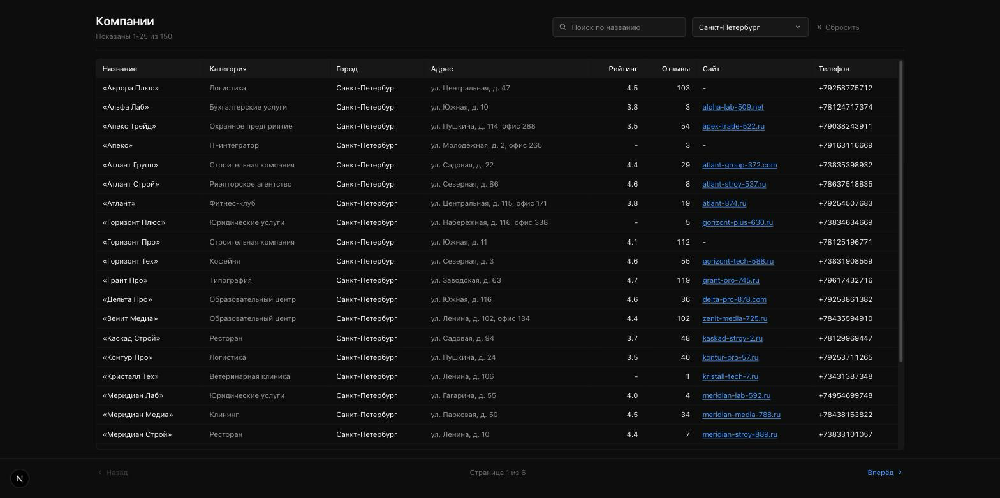
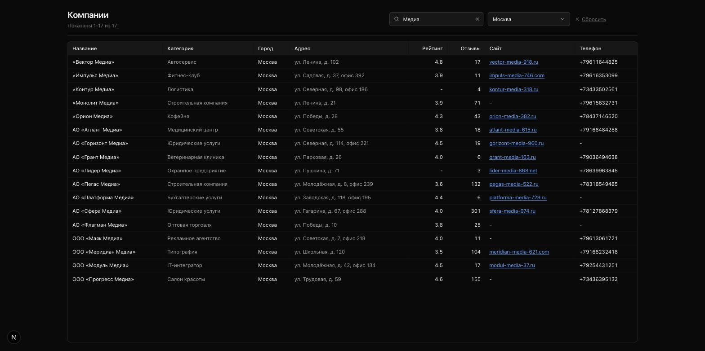
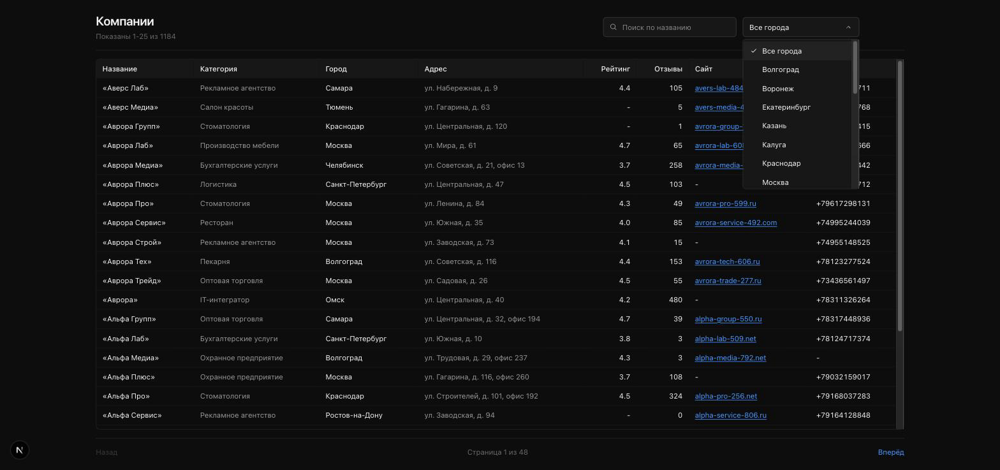
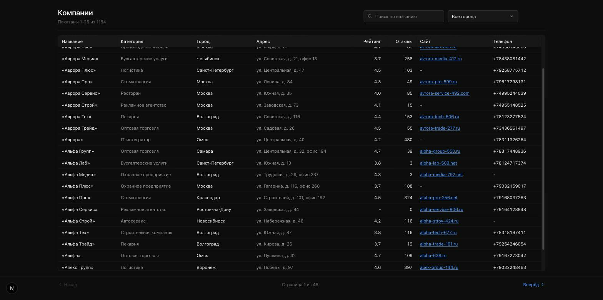

# polza-test-task

## Что это

Тестовое задание для Polza Agency: загрузить и почистить два источника данных о компаниях (постраничная выгрузка API в `data/page_001.json`...`page_020.json` и `data/review.csv`), сложить их в Postgres по единой схеме с дедупликацией, ответить тремя SQL-запросами на вопросы про категории, рейтинги и сайты, задокументировать аномалии в `review.csv`, и поднять страницу со списком компаний: поиск, фильтры по городу и категории, переключатель «только с сайтом», сортировка по клику на заголовок колонки, выбор размера страницы, пагинация, журнал аномалий (глобальный и по строке) и переключатель светлой/тёмной темы. В репозитории это разложено так:

- **Загрузка и нормализация** - `db/schema.sql`, `scripts/migrate.ts`, `scripts/load-companies.ts`, `scripts/load-review.ts`, `src/lib/normalize.ts`, `src/lib/dedup.ts`, `src/lib/ingest.ts`, `src/lib/csv.ts`.
- **SQL-запросы** - `db/queries.sql`, `scripts/run-queries.ts`.
- **Аномалии в review.csv** - `ANOMALIES.md`, `scripts/report-anomalies.ts` (генерируется из таблицы `ingest_issues`, не написан руками).
- **Веб-страница** - `src/app/companies` (список, поиск, фильтры по городу/категории/наличию сайта, сортировка, выбор размера страницы, пагинация, журнал аномалий, светлая/тёмная тема).

## Быстрый старт

```bash
cp .env.example .env
docker compose up -d
npm install
npm run migrate
npm run load:companies
npm run load:review
npm run queries
npm run dev        # http://localhost:3000/companies
```

## Кэш

Чтения `companies`/`ingest_issues` на `/companies` (список компаний,
справочник городов, журнал аномалий) кэшируются между запросами на 5 минут
(`COMPANIES_CACHE_REVALIDATE_SECONDS` в `src/lib/cache.ts`) - данные меняются
только вручную, повторным запуском загрузчика, поэтому нет смысла ходить в
Postgres на каждый клик по пагинации/фильтрам. Ключ кэша - конкретная
комбинация `q`, `city`, `category`, `hasSite`, `sort`, `dir`, `pageSize`,
`page` (и без аргументов - для справочника городов и журнала аномалий), так
что у каждой комбинации фильтров и сортировки свой собственный, не
пересекающийся с другими кэш.

После `npm run load:companies` / `npm run load:review` кэш сам обновится не
позже чем через 5 минут, но чтобы увидеть свежие данные сразу:

```bash
curl -X POST http://localhost:3000/api/revalidate-companies \
  -H "x-revalidate-secret: $REVALIDATE_SECRET"
```

Эндпойнт ничего не читает и не меняет в данных, но без защиты кто угодно на
публичном деплое мог бы дёргать его бесконечно, заставляя каждый следующий
запрос идти в Postgres вместо кэша - поэтому он требует заголовок
`x-revalidate-secret`, совпадающий с `REVALIDATE_SECRET` из `.env` (см.
`.env.example`). Локально, пока `NODE_ENV` не `production`, секрет можно не
задавать вовсе - эндпойнт тогда работает без него, как раньше. На проде без
заданного `REVALIDATE_SECRET` эндпойнт отказывает всегда.

## Живая версия

https://polza.selim.services/companies

## Схема базы

Три слоя, а не одна плоская таблица - чтобы плохая строка не терялась молча, а оставляла след.

| Таблица | Роль |
| --- | --- |
| `staging_companies` | Всё как пришло из источника, без ограничений и без валидации. Даже если строка дальше будет отброшена, она навсегда останется здесь вместе с исходным `raw jsonb`. |
| `companies` | Канонические данные: строгие типы, `CHECK`-ограничения на рейтинг и число отзывов, уникальность по `ext_id` и по `dedup_key`. Сюда попадает только то, что прошло валидацию. |
| `ingest_issues` | Журнал каждой починки, слияния или отбрасывания строки: код аномалии, что было, что стало, почему. Именно из этой таблицы генерируется `ANOMALIES.md` - отчёт не написан руками, он честный слепок реальной загрузки. |

Смысл разделения: строка с битым рейтингом или неизвестным городом не исчезает из системы - она либо чинится и попадает в `companies` с записью в журнале, либо отбрасывается с записью в журнале, но в любом случае остаётся видна в `staging_companies`.

## Дедупликация

Два прохода при вставке каждой строки в `companies` (`src/lib/ingest.ts`):

1. **По `ext_id`.** Ловит повторную выгрузку той же записи (например, одна и та же компания попала на две страницы API). Перед вставкой делается явный `SELECT` по `ext_id`; `UNIQUE`-индекс в схеме - это подстраховка на случай гонки, а не сам механизм обнаружения.
2. **По `dedup_key`** - хэш-ключ из нормализованных названия, города и адреса (кавычки, регистр, пунктуация и `ё`/`е` сняты, см. `normalizeForKey` в `src/lib/dedup.ts`). Этот проход ловит ту же компанию под совсем другим id.

Второй проход - это то, что поймало шесть "теневых" дублей в `review.csv` (`c_900006`...`c_900011`): те же компании, что уже загружены из API, но под новым пространством id и без кавычек в названии. По `ext_id` они прошли бы как новые записи. Реальный вывод загрузчика (`npm run load:review`):

```
Загрузка review.csv
  в staging:             207
  вставлено в companies: 190
  слито по ext_id:       9
  слито по dedup_key:    6
  отброшено строк:       2
  починено полей:        12
  обнулено полей:        10

Теневые дубли (та же компания под новым id):
  c_900006 -> уже загружена как c_000738
  c_900007 -> уже загружена как c_000642
  c_900008 -> уже загружена как c_000229
  c_900009 -> уже загружена как c_000656
  c_900010 -> уже загружена как c_000571
  c_900011 -> уже загружена как c_000957
```

Для сравнения, загрузка API-выгрузки (`npm run load:companies`) поймала свои 6 дублей уже первым проходом, по `ext_id` - там компании повторялись под тем же id на разных страницах:

```
Загрузка выгрузки из API
  в staging:            1000
  вставлено в companies: 994
  слито по ext_id:       6
  слито по dedup_key:    0
  отброшено строк:       0
```

Итог: в базе 1184 компании (994 из API + 190 из CSV), проверено прямым запросом:

```
   source   | count
------------+-------
 api_pages  |   994
 review_csv |   190
(2 rows)
```

## Индексы

```sql
CREATE UNIQUE INDEX companies_ext_id_uq     ON companies (ext_id);
CREATE UNIQUE INDEX companies_dedup_key_uq  ON companies (dedup_key);
CREATE INDEX        companies_city_idx      ON companies (city);
CREATE INDEX        companies_category_idx  ON companies (category);
CREATE INDEX        companies_name_trgm_idx ON companies USING gin (name gin_trgm_ops);
```

`ext_id_uq` и `dedup_key_uq` - подстраховка для дедупликации на случай гонки (сам механизм обнаружения дублей - явный `SELECT` до вставки, см. выше). `city_idx` и `category_idx` под фильтр и группировки. `name_trgm_idx` - триграммный GIN под поиск по подстроке (`ILIKE '%...%'`) на странице `/companies`.

Запрос в `src/lib/companies.ts` написан так, чтобы индексами вообще можно было воспользоваться: условия собираются в массив и попадают в `WHERE` только если параметр непустой, а не через `($1 = '' OR city = $1)` - при таком шаблоне планировщик теряет прямое сравнение колонки с константой и индекс использовать не может ни при каком размере таблицы.

Честно про текущее состояние: на 1184 строках планировщик выбирает план не по факту наличия индекса, а по запросу - для узкого термина берёт индекс, для широкого сам предпочитает seq scan, и оба плана получены без единой изменённой настройки.

Узкий термин, "Сфера" - 30 совпадений (2.5% строк), план - `Bitmap Index Scan` по `companies_name_trgm_idx`:

```
docker exec polza-db psql -U polza -d polza -c "EXPLAIN ANALYZE SELECT id FROM companies WHERE name ILIKE '%Сфера%';"

 Bitmap Heap Scan on companies  (cost=17.52..59.87 rows=24 width=8) (actual time=0.064..0.152 rows=30 loops=1)
   Recheck Cond: (name ~~* '%Сфера%'::text)
   Heap Blocks: exact=22
   ->  Bitmap Index Scan on companies_name_trgm_idx  (cost=0.00..17.51 rows=24 width=0) (actual time=0.055..0.055 rows=30 loops=1)
         Index Cond: (name ~~* '%Сфера%'::text)
 Planning Time: 1.019 ms
 Execution Time: 0.857 ms
```

Более широкий термин, "Медиа" - 94 совпадения (7.9% строк), план - обычный `Seq Scan`, без каких-либо настроек, отключающих индекс:

```
docker exec polza-db psql -U polza -d polza -c "EXPLAIN ANALYZE SELECT id FROM companies WHERE name ILIKE '%Медиа%';"

 Seq Scan on companies  (cost=0.00..64.80 rows=96 width=8) (actual time=0.017..1.165 rows=94 loops=1)
   Filter: (name ~~* '%Медиа%'::text)
   Rows Removed by Filter: 1090
 Planning Time: 1.459 ms
 Execution Time: 1.238 ms
```

Почему так: на 50 страницах таблицы (`pg_class.relpages`) оценки стоимости у обоих планов близкие - около 60-65 условных единиц, - поэтому баланс решает ожидаемое число совпадений, а не факт существования индекса. При 2.5% строк bitmap-скан по индексу с последующей проверкой по heap ещё дешевле seq scan (59.87 против 64.80). При 7.9% приходится поднять такую долю страниц кучи, что сам bitmap-проход перестаёт окупаться, и seq scan оказывается дешевле. По мере роста таблицы этот порог будет смещаться в пользу индекса на всё более широких терминах, а широкие запросы так и продолжат сканироваться целиком - и это ожидаемое поведение, а не деградация. Именно форма `WHERE` (сравнение колонки с константой, а не `OR`-заглушка) и оставляет планировщику этот выбор вообще.

Пишу как есть, а не как думал заранее: до первого реального `EXPLAIN` я предполагал, что на этом объёме индекс не используется вовсе - неверно, планировщик уже умеет выбирать между двумя планами по селективности запроса.

### Поиск теперь по шести полям, а не только по названию

`q` на странице `/companies` ищет по `name`, `category`, `city`, `address`, `site` и `phone_raw` одним `OR`-условием, обёрнутым в собственные скобки (`src/lib/companies.ts`, `buildWhere`) - без скобок `OR` "перетекает" в соседние `AND`-условия (`city =`, `category =`, `site IS NOT NULL`) и молча отключает их всякий раз, когда задан поиск. Поиск идёт по `phone_raw` (`+7 (495) 248-44-40`), а не по нормализованному `phone` (`+74952484440`): так пользователь может ввести `495` или `(495)` и найти компанию по коду города, а не только полный номер без разделителей.

`name_trgm_idx` покрывает только `name` и не может обслужить `OR` сразу по шести колонкам - составного или отдельных триграммных индексов под остальные пять не заводил, поэтому честно ожидать `Seq Scan`. Реальный план, тот же термин "Сфера", что и выше:

```
docker exec polza-db psql -U polza -d polza -c "EXPLAIN ANALYZE SELECT id FROM companies WHERE name ILIKE '%Сфера%' OR category ILIKE '%Сфера%' OR city ILIKE '%Сфера%' OR address ILIKE '%Сфера%' OR site ILIKE '%Сфера%' OR coalesce(phone_raw,'') ILIKE '%Сфера%';"

 Seq Scan on companies  (cost=0.00..79.60 rows=24 width=8) (actual time=0.012..2.530 rows=30 loops=1)
   Filter: ((name ~~* '%Сфера%'::text) OR (category ~~* '%Сфера%'::text) OR (city ~~* '%Сфера%'::text) OR (address ~~* '%Сфера%'::text) OR (site ~~* '%Сфера%'::text) OR (COALESCE(phone_raw, ''::text) ~~* '%Сфера%'::text))
   Rows Removed by Filter: 1154
 Planning Time: 2.332 ms
 Execution Time: 2.651 ms
```

На 1184 строках это некритично - 2.65 мс на полное сканирование таблицы, дешевле планирования отдельного bitmap-and по пяти-шести индексам, даже если бы они существовали. При росте таблицы на порядки `Seq Scan` начнёт стоить заметно дороже, и тогда правильный следующий шаг - не пять новых триграммных GIN-индексов по одному на каждую колонку (Postgres не умеет автоматически объединить bitmap-сканы пяти разных `gin_trgm_ops`-индексов в план ради одного `OR`, и завести их все ради размера, которого сейчас нет, значило бы платить за запись и место уже сегодня без единой доказанной выгоды), а полнотекстовый индекс (`tsvector`/`GIN` по конкатенации нужных колонок) или отдельный поисковый сервис - не добавляю ни то, ни другое сейчас, потому что 1184 строки не дают на этом ни одного реального замера.

Результаты подсветки и параметризации поиска (без прямого просмотра в браузере, тем же способом, что и остальной слой фильтров - см. "Как проверял"): `curl --get --data-urlencode "q=Ленина"` (термин встречается только в адресах) возвращает "Показаны 1-25 из 75", подтверждая, что поиск действительно ушёл дальше `name`. Тот же запрос с `city=Казань` даёт "Показаны 1-4 из 4" - меньше 75, а не столько же, что и подтверждает: `OR`-группа в скобках и не глушит `AND`-условие по городу. Отдельно `psql`: `SELECT count(*) FROM companies WHERE name ILIKE '%Ленина%' OR category ILIKE '%Ленина%' OR city ILIKE '%Ленина%' OR address ILIKE '%Ленина%' OR site ILIKE '%Ленина%' OR coalesce(phone_raw,'') ILIKE '%Ленина%'` даёт те же 75, а с добавленным `AND city = 'Казань'` - те же 4. В отданном HTML `grep -c "<mark"` по `q=Ленина` ненулевой - совпадения реально подсвечены.

Подсветка (`src/app/companies/highlighted.tsx`) построена на `splitHighlight` (`src/lib/highlight.ts`) - строка режется на куски вокруг совпадений, каждый кусок react рендерит как обычный текстовый узел, `dangerouslySetInnerHTML` нигде не используется: и `q`, и данные компаний - untrusted. Проверено `curl`-инъекцией `q=` - страница отдаёт 200 и пустую выдачу, `grep -o` по ответу показывает содержимое только в экранированном виде (`&lt;img src=x onerror=alert(1)&gt;` в HTML и `\u003cimg...\u003e` в JSON RSC-пейлоаде), нигде как настоящий ``-тег: `grep -c "<img src=x onerror"` по тому же ответу - `0`. Прямолинейный `grep -c "onerror=alert"` без учёта экранирования находит и эти безопасные вхождения тоже (не `0`) - сам по себе он не отличает экранированный текст от исполняемого тега, поэтому именно проверка на настоящий `<img src=x onerror` тег и есть содержательный тест.

## Запросы

Реальный вывод `npm run queries`:

```
1. Топ-5 категорий по числу компаний
------------------------------------
┌─────────┬─────────────────────────┬───────────┐
│ (index) │ category                │ companies │
├─────────┼─────────────────────────┼───────────┤
│ 0       │ 'IT-интегратор'         │ '111'     │
│ 1       │ 'Оптовая торговля'      │ '93'      │
│ 2       │ 'Рекламное агентство'   │ '90'      │
│ 3       │ 'Строительная компания' │ '86'      │
│ 4       │ 'Юридические услуги'    │ '72'      │
└─────────┴─────────────────────────┴───────────┘

2. Средний рейтинг по городам среди компаний с 10+ отзывами
-------------------------------------------------------------
┌─────────┬───────────────────┬────────────┬───────────┐
│ (index) │ city              │ avg_rating │ companies │
├─────────┼───────────────────┼────────────┼───────────┤
│ 0       │ 'Омск'            │ 4.43       │ '26'      │
│ 1       │ 'Пермь'           │ 4.42       │ '33'      │
│ 2       │ 'Сочи'            │ 4.36       │ '16'      │
│ 3       │ 'Тюмень'          │ 4.36       │ '27'      │
│ 4       │ 'Уфа'             │ 4.32       │ '39'      │
│ 5       │ 'Воронеж'         │ 4.31       │ '33'      │
│ 6       │ 'Екатеринбург'    │ 4.31       │ '60'      │
│ 7       │ 'Нижний Новгород' │ 4.31       │ '57'      │
│ 8       │ 'Ростов-на-Дону'  │ 4.31       │ '43'      │
│ 9       │ 'Новосибирск'     │ 4.3        │ '76'      │
│ 10      │ 'Казань'          │ 4.29       │ '50'      │
│ 11      │ 'Самара'          │ 4.29       │ '39'      │
│ 12      │ 'Краснодар'       │ 4.28       │ '60'      │
│ 13      │ 'Санкт-Петербург' │ 4.27       │ '123'     │
│ 14      │ 'Москва'          │ 4.24       │ '211'     │
│ 15      │ 'Волгоград'       │ 4.22       │ '36'      │
│ 16      │ 'Челябинск'       │ 4.17       │ '35'      │
│ 17      │ 'Калуга'          │ 4.14       │ '5'       │
│ 18      │ 'Тула'            │ 4.1        │ '7'       │
│ 19      │ 'Ярославль'       │ 4.08       │ '6'       │
└─────────┴───────────────────┴────────────┴───────────┘

3. Доля компаний с сайтом по категориям
-----------------------------------------
┌─────────┬─────────────────────────┬───────┬───────────┬───────────────┐
│ (index) │ category                │ total │ with_site │ pct_with_site │
├─────────┼─────────────────────────┼───────┼───────────┼───────────────┤
│ 0       │ 'Ресторан'              │ '48'  │ '41'      │ 85.4          │
│ 1       │ 'Клининг'               │ '20'  │ '17'      │ 85            │
│ 2       │ 'Производство мебели'   │ '52'  │ '43'      │ 82.7          │
│ 3       │ 'Юридические услуги'    │ '72'  │ '58'      │ 80.6          │
│ 4       │ 'IT-интегратор'         │ '111' │ '89'      │ 80.2          │
│ 5       │ 'Пекарня'               │ '29'  │ '23'      │ 79.3          │
│ 6       │ 'Фитнес-клуб'           │ '24'  │ '19'      │ 79.2          │
│ 7       │ 'Бухгалтерские услуги'  │ '61'  │ '48'      │ 78.7          │
│ 8       │ 'Риэлторское агентство' │ '45'  │ '35'      │ 77.8          │
│ 9       │ 'Образовательный центр' │ '53'  │ '41'      │ 77.4          │
│ 10      │ 'Автосервис'            │ '51'  │ '39'      │ 76.5          │
│ 11      │ 'Охранное предприятие'  │ '37'  │ '28'      │ 75.7          │
│ 12      │ 'Логистика'             │ '56'  │ '42'      │ 75            │
│ 13      │ 'Рекламное агентство'   │ '90'  │ '67'      │ 74.4          │
│ 14      │ 'Ветеринарная клиника'  │ '23'  │ '17'      │ 73.9          │
│ 15      │ 'Кофейня'               │ '36'  │ '26'      │ 72.2          │
│ 16      │ 'Медицинский центр'     │ '65'  │ '46'      │ 70.8          │
│ 17      │ 'Салон красоты'         │ '40'  │ '28'      │ 70            │
│ 18      │ 'Оптовая торговля'      │ '93'  │ '65'      │ 69.9          │
│ 19      │ 'Стоматология'          │ '59'  │ '40'      │ 67.8          │
│ 20      │ 'Строительная компания' │ '86'  │ '58'      │ 67.4          │
│ 21      │ 'Типография'            │ '32'  │ '20'      │ 62.5          │
└─────────┴─────────────────────────┴───────┴───────────┴───────────────┘
```

Все три запроса с комментариями, объясняющими выбор фильтров и агрегатов, - в `db/queries.sql`.

## Как проверял

Проверял страницу `/companies` вручную в Chrome (`npm run dev`, порт 3000), на реальной загруженной базе из 1184 компаний, без запуска миграций и загрузчиков заново. Прогнал список, поиск, фильтр по городу, комбинацию поиска и города, сброс страницы при смене фильтра, прямой заход по расшаренной ссылке с `page=2`, выход за границу пагинации, пустую выдачу и консоль/сеть на утечку строки подключения к базе. В процессе нашёл и исправил три реальных бага.

Первый - React Strict Mode тихо стирал номер страницы из расшаренных ссылок. Эффект с debounce в `filters.tsx` использовал флаг "первый рендер", чтобы не переписывать URL сразу при монтировании. App Router в dev-режиме вызывает эффекты дважды: первый вызов сбрасывал флаг, второй решал, что это уже не первый рендер, срабатывал debounce и переписывал URL - без `page`, потому что пользователь ничего не менял. В итоге ссылка вида `?q=..&city=..&page=2` теряла `page` из адресной строки примерно через 300 мс после загрузки без какого-либо действия пользователя. Починил сравнением с последним значением, которое сам же эффект применил, вместо подсчёта количества вызовов - это работает одинаково независимо от того, сколько раз Strict Mode вызовет эффект.

Второй - номер страницы за пределами выдачи рендерил обратный диапазон: `?page=999999` печатал что-то вроде "Показаны 24999951-1184 из 1184".

Третий, самый важный - первое исправление второго бага сделало ситуацию хуже, а не лучше. Зажатие применялось только к отображаемым числам, а сам запрос к базе всё ещё уходил с сырым, зашкаливающим номером страницы - в итоге заголовок показывал вполне правдоподобное "Показаны 1176-1184 из 1184" над полностью пустой таблицей, потому что запрос под ним всё ещё просил строки, которых не существует. Убедительная ложь в интерфейсе хуже, чем очевидно сломанный вывод. Настоящее исправление - перенести зажатие раньше, в слой данных, до вычисления `offset`, там, где известен реальный total, - так заголовок и строки под ним всегда говорят про одну и ту же страницу. Проверил это заходом на `?page=999999`: заголовок "Показаны 1176-1184 из 1184" и ровно 9 реальных строк под ним, а не пустая таблица.

Более поздний слой поверх этого - фильтр по категории, чекбокс «только с сайтом», сортировка по колонкам, выбор размера страницы, журнал аномалий и светлая/тёмная тема - строился и проверялся уже под действующим правилом не смотреть на свою же UI-работу в браузере самому. Вместо кликов эти изменения проверялись напрямую по серверному рендеру: `curl` по `/companies` с разными `?sort=`/`?dir=`/`?category=`/`?hasSite=1`/`?limit=` и разбором отдаваемого HTML (`aria-sort` на активном заголовке колонки, набор и порядок строк сверен с тем, что должен вернуть SQL-запрос при тех же параметрах), прямые запросы к Postgres, чтобы сверить числа с тем, что показывает страница, и `npm test`/`npm run typecheck`. Скриншоты `07-city-select.png` и `08-layout.png` относятся к более раннему слою (замена нативного `<select>` на кастомный listbox, раскладка со sticky-шапкой и sticky-футером) и сняты до того, как это правило вступило в силу - категория, `hasSite`, сортировка, размер страницы, аномалии и тема визуально не проверялись, только через HTML/SQL/тесты.

Отдельная регрессия, найденная security-ревью уже на проде: повторный query-параметр (`?city=a&city=b`) отдавал 500, потому что Next присылает повторяющийся параметр массивом строк, а тип `searchParams` страницы утверждал, что это всегда строка - `.trim()` падал на массиве, и пользователь видел `error.tsx` с диагнозом "база недоступна", не имеющим отношения к причине. Починил в `src/lib/company-params.ts` (`parseCompanyPageParams`, единая точка разбора всех параметров страницы, с тестами на массивовые входы в `tests/companies.test.ts`) и проверил `curl`-матрицей: `q`, `city`, `category`, `sort`, `page` - каждый с повторным значением - все вернули 200 и настоящую страницу (по `grep` на "Показаны"/"Ничего не найдено" в ответе, а не на `error.tsx`), плюс отдельно с реальным городом (Челябинск, 42 совпадения) - чтобы отличить "фильтр взял первое значение и что-то нашёл" от "фильтр просто ничего не нашёл".

## Скриншоты


`/companies` - 25 строк из 1184, счётчик "Показаны 1-25 из 1184".


`?q=Сфера` - 30 совпадений, во всех строках название содержит "Сфера".


`?city=Казань` - 63 компании, во всех строках город "Казань".


`?city=Москва&q=Медиа` - 17 совпадений на пересечении обоих условий.


`?city=Москва&q=щщщ` - состояние "Ничего не найдено", блок пагинации не показан.


Кастомный listbox вместо нативного `<select>` - свой попап и своя тема вместо системного.


Таблица прокручена в середину списка - шапка с заголовками колонок и полоса пагинации внизу остаются на месте, скроллится только тело таблицы.

## Тесты

```
> polza-test-task@1.0.0 test
> vitest run --maxWorkers=3

 Test Files  5 passed (5)
      Tests  70 passed (70)
```

70 тестов в пяти файлах: `tests/csv.test.ts` (8 тестов на парсер CSV - поля в кавычках с запятыми и переносами строк, экранированные кавычки, CRLF, пустые строки), `tests/normalize.test.ts` (26 тестов на восстановление моджибейка, нормализацию города через точное совпадение/латинские алиасы/расстояние Левенштейна, разбор рейтинга, числа отзывов, сайта и телефона), `tests/dedup.test.ts` (13 тестов на ключ дедупликации и распознавание сдвига колонок), `tests/highlight.test.ts` (9 тестов на разбиение подсвечиваемого совпадения в результатах поиска - середина/начало/конец строки, регистронезависимость, спецсимволы регулярных выражений, отсутствие потери или дублирования символов), `tests/companies.test.ts` (14 тестов).

`tests/companies.test.ts` - самый показательный для ревьюера файл в репозитории: он напрямую демонстрирует защиту от SQL-инъекции через `ORDER BY`/`LIMIT`, описанную в комментариях `company-params.ts` - `resolveSortKey`/`resolveSortDir`/`resolvePageSize` пропускают наружу только значения из захардкоженного белого списка, а любой посторонний или вредоносный параметр (включая `'reviews_count; DROP TABLE companies;--'`) тихо откатывается к дефолту, не долетая до текста SQL-запроса. Отдельный блок - регрессионные тесты на `parseCompanyPageParams` с параметрами-массивами (`?city=a&city=b` и подобные), воспроизводящие продовый краш из раздела "Как проверял" выше.

База данных намеренно не покрыта юнит-тестами. `ingest()` - это транзакция с побочными эффектами (вставки в три таблицы, `SELECT` перед вставкой для обнаружения дублей), гонять её в юнит-тестах означало бы либо мокать `pg.Pool` до потери смысла проверки, либо поднимать реальный Postgres в CI, которого для этой задачи нет. Вместо этого её поведение проверено самим фактом успешной загрузки: числа в выводе `npm run load:companies` / `npm run load:review` (994/190 вставлено, 6/9 слито по `ext_id`, 6 слито по `dedup_key`) и в `ANOMALIES.md` сошлись с ожидаемыми построчно, а `npm run typecheck` проходит без ошибок.

## Что стоит проверить у вас на стороне

1. `review.csv` - это не отзывы. Схема файла совпадает с выгрузкой компаний один в один: те же девять полей. Судя по формулировке ТЗ, это, похоже, и есть тот самый подвох "мы что-то перепутали".
2. Шесть строк (`c_900006`...`c_900011`) заново заходят в уже загруженные компании под новым пространством id, отличаясь только снятыми кавычками в названии - город, адрес, телефон, сайт, рейтинг и число отзывов совпадают побайтово. Загрузка с ключом по id пропустила бы все шесть молча и раздула бы базу.
3. Две разные компании делят домен сайта: `c_001124` и `c_000631` - `https://ip-73.ru`, `c_001120` и `c_000025` - `https://ip-445.ru`. Это не дубли, компании разные - но для холодной рассылки, где домен обычно и есть ключ отправки, это ловушка.
4. Постраничная выгрузка компаний по API отдаёт 1000 строк, но из них только 994 различных id - шесть компаний встречаются на двух разных страницах. `total: 1000` при этом честный подсчёт строк и сам по себе не ошибка - находка в том, что эндпойнт отдаёт дубли внутри этих 1000 строк, а не в том, что число неверное.
5. Критерии оценки высоко ставят "качество базы - реальные, валидные email", но ни в одном из файлов `data_pack` (ни в JSON-страницах, ни в `review.csv`) поля email нет вообще. Не хватает части выгрузки, или предполагался отдельный шаг обогащения данных, который не попал в это задание?

## Что не сделано / ограничения

- `buildDedupKey` мапит `null`-адрес в пустую строку при построении ключа дедупликации. Это значит, что две разные компании с одинаковым названием и городом и обе без адреса теоретически слились бы в одну запись. В этом датасете такого не происходит - проверено: ни одной пустой строки адреса среди 1000 строк из JSON, а единственная пустая строка адреса в CSV принадлежит той самой строке со сдвигом колонок, чей адрес восстанавливается до построения ключа. Но это допущение, а не доказанный инвариант на любых будущих данных.
- Нет end-to-end или браузерных автотестов. Проверка страницы `/companies` была ручной, ход и результаты - в разделе "Как проверял" выше.
- Деплой ручной, CI для этого репозитория нет.
